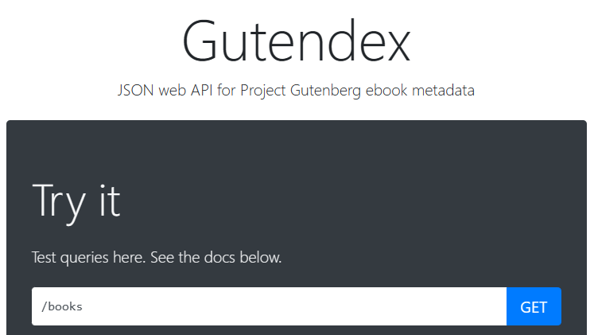
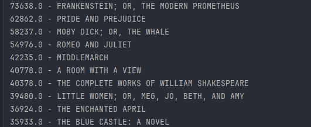
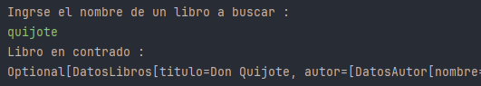
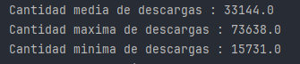
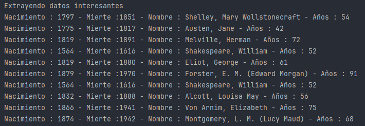

# Aplicaión de Java con Spring Boot (en consola)

## Consumo de api de la web: https://gutendex.com/books/

Respuestas obtenidas en el consumo de la API:

### Top 10 libros mas descargados en la esa web

### Buscar libro por artista

### Estadisticas de los libros en la web

### Extrayendo información adicional del contenido de JSON
#### La edad de los escritores no se encuentra entre la información proporcionada por el JSON pero es calculada restando su año de fallecimiento menos su año de nacimiento.

